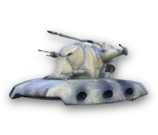

xWing Widget
============

This was my first Widget I made back in 2005 and I still have it in my Dashboard, the [original Website](http://widgetschmie.de/widgets/xWing/) is still up.

It does nothing more than display one of several **Star-Wars&trade;** related Images</b> sized 175 x 150 pixel. You can switch the images at your leisure, and it is possible to simply drop your own images into the Images-folder inside the Widget-package, they will instantly show up in the preferences. Your Images _should_ be 175 pixel in width and 150 pixel in height as they will get distorted if they're not that size. You can also set the widget to display a slideshow.

Here are the included Images
----------------------------

